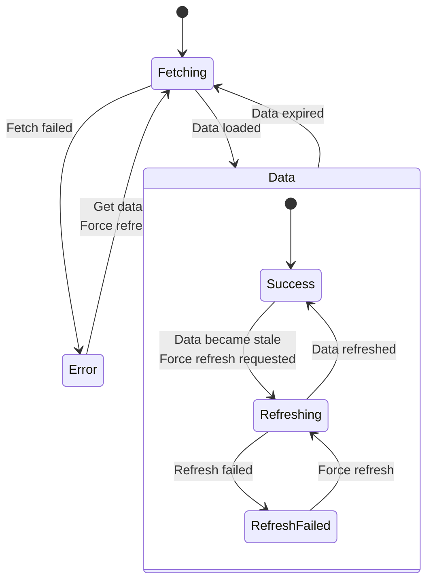

# RetroCache
_**Work in progress**_


RetroCache is a library on top of Retrofit2, which helps with caching of requests and responses.
It exposes its data as a finite state machine, to be observed by the consumer of this library.
It has 3 very straight forward methods:
* `fun observeData(): Flow<RequestState<R>>`
* `suspend fun getData(forceRefresh: Boolean): Result<R>`
* `fun forceRefresh()`

The finite state machine that is created per request looks like this:



## Gradle dependency

To use this library, just add the following dependency to your project.

```kotlin
implementation("io.github.hylkeb:retrocache:$version")
```

## Usage

RetroCache consists of the following components:
* `CacheableRequest`: The class used to observe the response and control the refreshing mechanism
* `RequestState`: The state emitted by the CacheableRequest, models all the possible states the request can be in. Useful to observe to switch between a full screen spinner, pull to refresh spinner, full screen error message, error dialog, old data notification etc.
* `CacheableRequestCallAdapterFactory`: Required to let retrofit adapt calls into `CacheableRequest` instances
* `CacheConfiguration`: Used to configure the cache.
* `CachingInterceptor`: Optionally used if the response must also be persisted outside of memory
* `CacheProvider`: An interface responsible for storing and retrieving cached responses. RetroCache provides a FolderCacheProvider out of the box.

### Basic usage

**1: Add the `CacheableRequestCallAdapterFactory` to the `RetrofitBuilder`**
```kotlin
Retrofit.Builder()
    ...
    .addCallAdapterFactory(CacheableCallAdapterFactory())
    ...
    .build()
```

**2: Configure your Retrofit request and response**
```kotlin
interface ApiService {
    @GET("some/url/to/fetch")
    fun getSomeData(): CacheableRequest<Data> // "Data" is the typed data as converted by the registered ConverterFactory
}
```

**3: Use the cacheable request**
```kotlin
class SomeRepository(private val apiService: ApiService) {
    // Put the cachedRequest in memory by declaring it in the Repository layer
    private val cachedRequest: CacheableRequest<Data> by lazy { apiService.getSomeData() }
    
    // As soon as a consumer observes this dataFlow, the cache will be used and if not available the api will be executed
    val dataFlow: Flow<RequestState<Data>> by lazy { cachedRequest.observeData() }
    
    // E.g. happening on a pull to refresh, will make the next successful response is from the remote, which will be emitted to the dataFlow that is still being observed
    fun refreshData() {
        cachedRequest.forceRefresh()
    }
    
    // An alternative way to expose the data to other consumers, will return the data once its available
    suspend fun getDataDirectly(): Result<Data> {
        return cachedRequest.getData(forceRefresh = false)
    }
}
```

### Advanced use case, response persistence

RetroCache also supports response persistence, which is particularly helpful when developing an app with offline support.
The following steps show how to configure RetroCache to include persistence.

**1: Define a `CacheProvider`**

Out of the box RetroCache has a `FolderCacheProvider` available, which will persist responses in the given directory.

Alternatively, a custom `CacheProvider` can also be defined by providing a custom implementing of said interface. Use cases for this are for example when the responses must be encrypted with some app (or user) specific key.

The following code shows how a `FolderCacheProvider` could be instantiated (using Dagger Hilt):
```kotlin
@Provides
fun provideCacheProvider(@ApplicationContext context: Context): CacheProvider {
    return FolderCacheProvider(context.cacheDir)
}
```

**2: Configure Retrofit to use the `CacheProvider`**

Due to how retrofit works, the `CacheProvider` must be included in 2 separate components. 

In the constructor for the CacheableRequestCallAdapterFactory the CacheProvider must be provided, this is used by the CacheableRequest to first check if a cached copy of the response is available.
```kotlin
Retrofit.Builder()
    ...
    .addCallAdapterFactory(CacheableCallAdapterFactory(cacheProvider = folderCacheProvider)) // as instantiated in the previous step
    ...
    .build()
```

Additionally, the CacheProvider must also be provided in a CachingInterceptor on the OkHttpClient. This CachingInterceptor is responsible for storing the responses.
```kotlin
OkHttpClient.Builder()
    ...
    .addInterceptor(CachingInterceptor(folderCacheProvider))
    ...
    .build()
```

> Note: The reason this is split up in 2 separate components is because Retrofit does not allow any hooks to read the raw response in any way, therefore an OkHttp interceptor is mandatory in case persistence is required

**3: Configure the Retrofit request to allow for persistence**

When defining a request and response in the retrofit service, an additional Tag must be provided containing the `CacheConfiguration` for this request.
By default the CacheConfiguration does not allow persistence, and no expiration or stale duration is configured.

```kotlin
interface ApiService {
    @GET("some/url/to/fetch")
    fun getSomeData(
        @Tag cacheConfiguration: CacheConfiguration = CacheConfiguration(
            // cached responses within this duration are not automatically refreshed
            staleDuration = 3.days,
            
            // cached responses within this duration, but outside the stale duration, are automatically refreshed while also directly returning the cached response. (e.g. immediately going to Refreshing)
            // responses older than this duration are removed and not returned, and a new apicall is being executed to get a new copy 
            expirationDuration = 7.days,  
            
            persistedCache = true,
        )
    ): CacheableRequest<Data>
}
```

### Advanced use case, show data is old

Whenever the RequestState is in the `RequestState.Data` state, apart from the result, also some metadata is available; whether or not it came from the cache and when the response was fetched.
Using this metadata, implementing a feature where a warning is shown to the user when the data is fairly old is a breeze.
```kotlin
@Composable
fun ComposableFunction(dataState: RequestState<Data>) {
    // other cases can also be added; e.g. full screen spinner for RequestState.Fetching and full screen error for RequestState.Error
    if (dataState is RequestState.Data) {
        if (dataState.fromCache && dataState.getAge(System.currentTimeMillis()) > 5.days) {
            // show warning badge that the data is fairly old
        }
        if (dataState is RequestState.Data.Refreshing) {
            // show spinner indicating data is being refreshed
        }
        if (dataState is RequestState.Data.RefreshFailed) {
            // show message refresh failed; possibly keeping track of some local state to hide the message once dismissed
            // another button could initiate the refresh which also removes this message 
        }
        // Show the data regardless of sub state
    }
}
```
